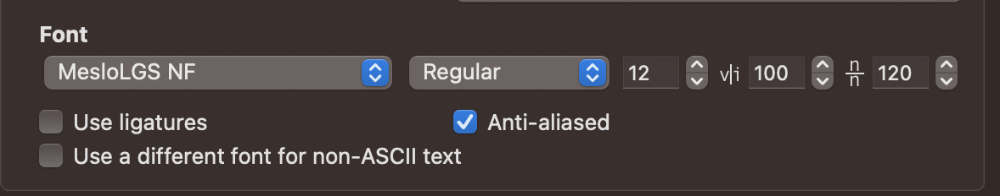

# Dotfiles

Personal dev environment config: `zsh`, `tmux`, `nvim` (primary editor), minimal `vim` (fallback), `git`, plus VSCode keybindings and an iTerm profile. macOS-first, also tested on Debian/Arch/Alpine Linux.

## What's in here

- **zsh** — Oh My Zsh + Powerlevel10k, syntax highlighting, autosuggestions. See [docs/zsh.md](docs/zsh.md).
- **tmux** — minimal config with TPM. See [docs/tmux.md](docs/tmux.md).
- **nvim** — primary editor. lazy.nvim, Mason, Snacks, conform, treesitter. See [docs/nvim.md](docs/nvim.md).
- **vim** — fallback editor. vim-plug, CoC (or ALE without Node), fzf, fugitive, lazygit via floaterm. See [docs/vim.md](docs/vim.md).
- **git** — `git/gitconfig` (symlinked to `~/.gitconfig`) and `git/gitignore_global`. Machine-local overrides via `~/.gitconfiglocal` (auto-included if present).
- **fonts** — JetBrains Mono Nerd Font. See [docs/fonts.md](docs/fonts.md).
- **vscode** — `vscode/settings.json`, `vscode/keybindings.json` symlinked into VS Code's user dir on macOS. See [docs/vscode.md](docs/vscode.md).
- **fzf** — usage notes in [docs/fzf.md](docs/fzf.md).
- **pass / gpg** — Unix password manager wiring. See [docs/pass.md](docs/pass.md) and [docs/gpg.md](docs/gpg.md).
- **terminals/osx-iterm2** — iTerm profile preset.

## Install

```bash
cd ~
git clone https://github.com/anxolin/dotfiles.git
./dotfiles/install.sh
```

`install.sh` does:

1. Backs up existing home-side dotfiles to `~/dotfiles/backup/backup_<timestamp>/` (last 10 retained per prefix).
2. Wipes the previous symlinks and recreates them from `dotfiles.list`.
3. On macOS: also links `vscode/settings.json` and `vscode/keybindings.json` into `~/Library/Application Support/Code/User`.
4. Installs Oh My Zsh + Powerlevel10k + plugins into `~/.oh-my-zsh`.
5. Installs the tmux plugin manager (TPM).
6. Installs apps via brew (macOS) or apt/pacman/apk (Linux): zsh, ripgrep, fd, fzf, bat, tldr, lnav, gh, uv, ruff, pass/gnupg, etc.
7. Installs JetBrains Mono Nerd Font.
8. Sets up nvim and vim (with vim-plug + plugin install).

Flags:

- `-a`, `--skip-install-apps` — skip the apps/fonts step.
- `-v`, `--skip-install-vim-plugins` — skip `:PlugInstall`.

## Customization

- **Machine-local zsh config** — drop scripts into `~/.zsh/` (`alias.zsh`, `config.zsh`, `dev.zsh`, `path.zsh`); `install.sh` creates these as empty files. They are sourced by `zsh/zshrc`.
- **Machine-local git config** — put work email / GPG key / signing config in `~/.gitconfiglocal`. It is auto-included by `git/gitconfig` and not tracked.

## iTerm2 (macOS)

Import `terminals/osx-iterm2/Default-profile.json` in iTerm2 (`Preferences > Profiles > Other Actions > Import`).

Recommended settings:

- Color preset: Catppuccin Mocha (matches the tmux and nvim themes).
- Terminal type: `xterm-256color`.
- Font: JetBrains Mono Nerd Font.
- Vertical character spacing: 120%.

<p align="center">
  
</p>

## Restore / revert

`install.sh` snapshots home-side dotfiles into `~/dotfiles/backup/backup_<timestamp>/` before symlinking. To revert a single file:

```bash
cp ~/dotfiles/backup/backup_<timestamp>/.zshrc ~/.zshrc
```

Retention is 10 most recent snapshots per prefix (`backup_`, `nvim_`, `tmux_`); older ones are pruned automatically on each install.

## Update

Pull latest config and re-run the relevant installer:

```bash
cd ~/dotfiles && git pull
# Re-run a specific piece if you changed something:
./install/install-zsh.sh
./install/dotfiles_nvim.sh
```

A full re-run is also safe: `./install.sh --skip-install-apps`.
